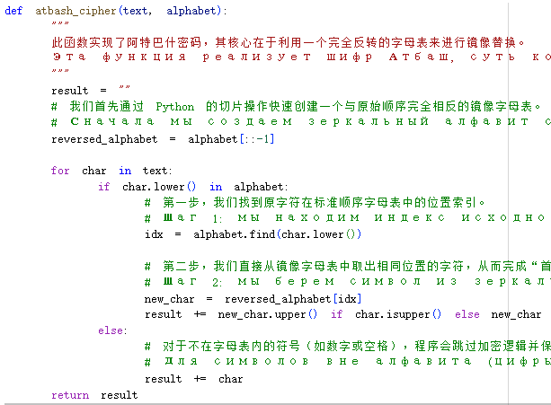
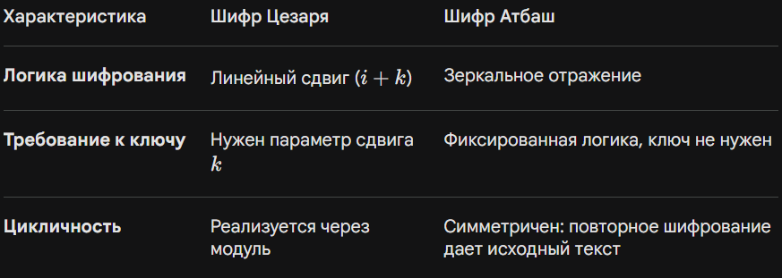

# Цель работы

## Основная цель

я подробно расскажу вам о содержании первой главы лабораторной работы, посвященной «Шифрам простой замены», и на примере написанного мною кода продемонстрирую, как пошагово выполнить практические задания.

## Обзор содержания первой главы

В этой главе мы изучили основные принципы функционирования шифров простой замены. Основная идея заключается в том, что символы исходного алфавита заменяются символами шифроалфавита по определенному правилу.

Для выполнения заданий я использовал язык Python. Вот логика моей реализации:

## Шаг 1: Определение базовых данных

Прежде всего, я определил строку стандартного русского алфавита, состоящую из 33 букв. Это база для всех дальнейших вычислений.

## Шаг 2: Реализация шифра Цезаря (с произвольным ключом k)

В функции `caesar_cipher` я обрабатываю каждый символ по следующему алгоритму:

- Определение индекса: Сначала с помощью функции `find` я нахожу числовую позицию символа в алфавите.

- Выполнение сдвига: К этой позиции прибавляется ключ $k$. Чтобы обработать выход за пределы алфавита, я использую операцию взятия остатка: `(index + k) % 33`. Так, после буквы «я» сдвиг безопасно возвращается к букве `«а»`.

- Восстановление символа: Полученный новый индекс преобразуется обратно в букву с сохранением исходного регистра (заглавная или строчная).

## шифра Цезаря компилятора

## шифра Цезаря результат

## Шаг 3: Реализация шифра Атбаш

В функции `atbash_cipher` логика еще более наглядна:

- Создание зеркала: С помощью среза `[::-1]` я быстро генерирую полностью перевернутый алфавит.

- Прямое отображение: Программа находит позицию символа в обычном алфавите и берет соответствующий символ из зеркального алфавита по тому же индексу.

## шифра Атбаш компилятора

## шифра Атбаш результат

## Таблица сравнения логики

# Итоги работы

## Вывод

Следуя этим шагам, я успешно реализовал алгоритмы, требуемые в лабораторной работе. Этот подход обеспечивает точность шифрования и гибкость при работе с любыми текстами и ключами.
