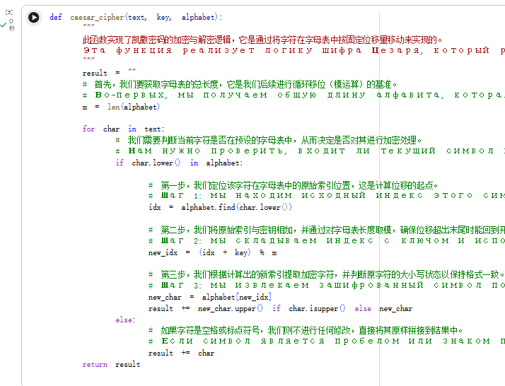
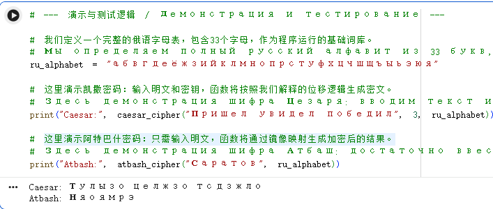
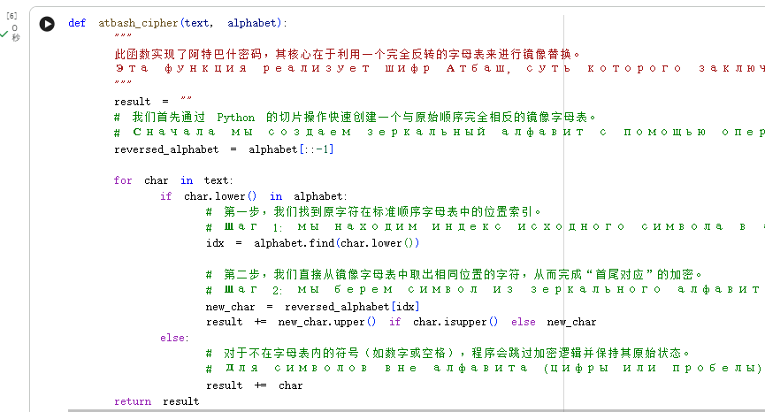

---
## Front matter
title: "Отчёт по лабораторной работе №1"
subtitle: "Математические основы защиты информации и информационной безопасности"
author: "Ли Хан"

## Generic otions
lang: ru-RU
toc-title: "Содержание"

## Bibliography
bibliography: bib/cite.bib
csl: pandoc/csl/gost-r-7-0-5-2008-numeric.csl

## Pdf output format
toc: true
toc-depth: 2
lof: true
lot: true
fontsize: 12pt
linestretch: 1.5
papersize: a4
documentclass: scrreprt
## I18n polyglossia
polyglossia-lang:
  name: russian
  options:
    - spelling=modern
    - babelshorthands=true
polyglossia-otherlangs:
  name: english
## I18n babel
babel-lang: russian
babel-otherlangs: english
## Fonts
mainfont: IBM Plex Serif
romanfont: IBM Plex Serif
sansfont: IBM Plex Sans
monofont: IBM Plex Mono
mathfont: STIX Two Math
mainfontoptions: Ligatures=Common,Ligatures=TeX,Scale=0.94
romanfontoptions: Ligatures=Common,Ligatures=TeX,Scale=0.94
sansfontoptions: Ligatures=Common,Ligatures=TeX,Scale=MatchLowercase,Scale=0.94
monofontoptions: Scale=MatchLowercase,Scale=0.94,FakeStretch=0.9
mathfontoptions:
## Biblatex
biblatex: true
biblio-style: "gost-numeric"
biblatexoptions:
  - parentracker=true
  - backend=biber
  - hyperref=auto
  - language=auto
  - autolang=other*
  - citestyle=gost-numeric
## Pandoc-crossref LaTeX customization
figureTitle: "Рис."
tableTitle: "Таблица"
listingTitle: "Листинг"
lofTitle: "Список иллюстраций"
lotTitle: "Список таблиц"
lolTitle: "Листинги"
## Misc options
indent: true
header-includes:
  - \usepackage{indentfirst}
  - \usepackage{float}
  - \floatplacement{figure}{H}
---

# Цель работы

Целью данной работы является изучение основных принципов функционирования шифров простой замены, а также освоение математических моделей шифра Цезаря и шифра Атбаш. В ходе практики необходимо реализовать алгоритмы шифрования и дешифрования для текстов на русском языке и проверить логику применения моноалфавитных подстановок в защите информации.

# Ход выполнения

## Реализация шифра Цезаря (Шифр Цезаря)

Суть шифра Цезаря заключается в циклическом сдвиге каждого символа открытого текста на фиксированное расстояние $k$ (ключ) в пределах алфавита.

- Математическая модель: Процесс шифрования описывается формулой $E(i) = (i + k) \mod m$, где $i$ — индекс символа, а $m$ — мощность (длина) алфавита.

- Этапы реализации:

  - Создание индексной таблицы, содержащей 33 буквы русского алфавита.

  - Ввод произвольного целого числа в качестве ключа `k`.

  - Использование операции модуля для обработки сдвига, что гарантирует циклический переход  при выходе индекса за границы алфавита.

  - Сохранение пробелов и специальных знаков в исходном виде без выполнения вычислений.

## шифра Цезаря компилятора

## результат

## Реализация шифра Атбаш (Шифр Атбаш)

Шифр Атбаш является специфическим видом моноалфавитной подстановки, который не требует числового ключа и основывается на зеркальном отражении алфавита.

- Описание принципа: Символы алфавита заменяются по принципу соответствия начала и конца списка. В контексте русского языка: 1-я буква «а» заменяется на 33-ю букву «я», 2-я буква «б» — на 32-ю букву «ю» и так далее.

- Этапы реализации:
  
  - Формирование последовательности прямого алфавита.

  - Генерация последовательности инвертированного алфавита.

  - Обработка входного текста: определение позиции символа в прямом алфавите и извлечение соответствующего символа из зеркального по тому же индексу.

  - Данный алгоритм обладает свойством симметричности: процессы шифрования и дешифрования идентичны.

## шифра Атбаш компилятора

## шифра Атбаш результат

# Вывод

В результате выполнения лабораторной работы были успешно реализованы шифр Цезаря с поддержкой произвольного ключа и шифр Атбаш, основанный на зеркальном отображении. Эксперимент подтвердил, что, несмотря на простоту реализации и прозрачность логики, шифры простой замены обладают низкой криптостойкостью и уязвимы для частотного анализа. В современной криптографии данные алгоритмы используются преимущественно в качестве базовых моделей для изучения принципов кодирования.

