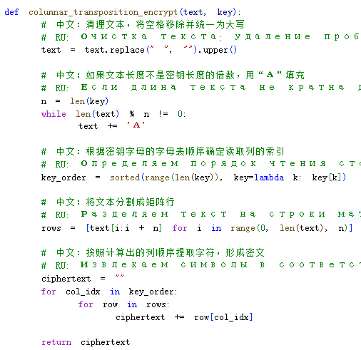
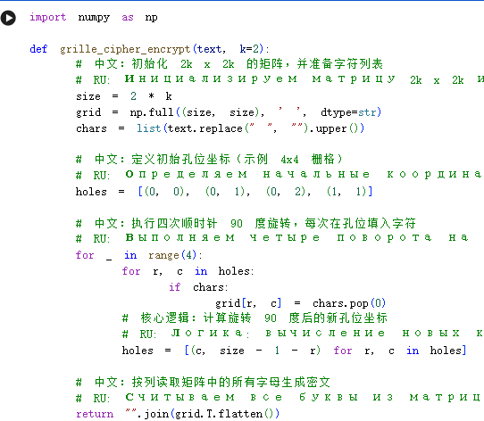
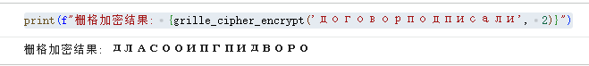
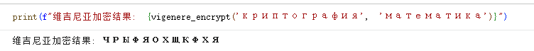

# Цель работы

## Основная цель

Сегодня я хочу поделиться результатами своей лабораторной работы по теме «Шифры перестановки». В ходе эксперимента я исследовал три классических метода: маршрутное шифрование, шифрование с помощью решеток и шифр Виженера. Моя цель — показать, как древняя математическая логика превращается в автоматизированный инструмент шифрования с помощью кода на Python.

# Анализ ключевых алгоритмов

## Шаг 1: Маршрутное шифрование

При реализации этого алгоритма я сначала построил логическую матрицу. Я вписал открытый текст по строкам, а ключевым этапом стала «перестановка столбцов». С помощью функции `sorted` я отсортировал ключ и определил очередность чтения каждого столбца. Таким образом, сами символы не изменились, но их порядок был полностью нарушен.

## маршрутного шифрования компилятора

## результат

## Определение размерности матрицы

- Ключ: `пароль` (длина — 6)

- Открытый текст: `нельзянедооцениватьпротивника` (28 символов).

- Расчет строк: Текст разбивается на блоки длиной `n=6`. Всего получается `m=5` блоков.

- Дополнение: Чтобы заполнить матрицу $5 \times 6$ (30 ячеек), к последнему блоку приписываются произвольные символы (в данном примере добавлены `а` и `я`)

## Запись текста в таблицу

## Определение порядка столбцов (Ключ)

Порядок выписывания букв определяется алфавитным порядком букв пароля `пароль`

а (2-й столбец)

л (5-й столбец)

о (4-й столбец)

п (1-й столбец)

р (3-й столбец)

ь (6-й столбец)

## Чтение по столбцам (Результат)

Мы выписываем буквы из таблицы, следуя маршруту (порядку столбцов):

- 1-й приоритет (буква «а»): е, е, н, п, н $\rightarrow$ ЕЕНПН.

- 2-й приоритет (буква «л»): з, о, а, т, а $\rightarrow$ зоата.

- 3-й приоритет (буква «о»): ь, о, в, о, к $\rightarrow$ ьовок.

- 4-й приоритет (буква «п»): н, н, е, ь, в $\rightarrow$ ннеьв.

- 5-й приоритет (буква «р»): л, д, и, р, и $\rightarrow$ ЛДИРИ.

- 6-й приоритет (буква «ь»): я, ц, т, и, а $\rightarrow$ яцтиа.

## Шаг 2: Шифрование с помощью решеток

Это, на мой взгляд, самая интересная часть. Метод имитирует вращающуюся картонную пластину с прорезями. В коде я использовал матрицу numpy для представления этой пластины и реализовал поворот на 90 градусов по часовой стрелке с помощью формулы преобразования координат `(c, size - 1 - r)`. На каждом этапе я вписывал часть символов, пока все четыре направления не были заполнены.

## шифрования с помощью решеток компилятора

## результат

## Разбор логики заполнения

- 1-й проход ($0^\circ$): в позиции (0,0), (0,1), (0,2), (1,1) вписаны `Д, О, Г, О`.

- 2-й проход ($90^\circ$): координаты стали (0,3), (1,3), (2,3), (1,2), вписаны `В, О, Р, П`.

- 3-й проход ($180^\circ$): координаты стали (3,3), (3,2), (3,1), (2,2), вписаны `О, Д, П, И`.

- 4-й проход ($270^\circ$): координаты стали (3,0), (2,0), (1,0), (2,1), вписаны `С, А, Л, И`.

результат: `ДЛАСООИПГПИДВОРО`

## Шаг 3: Шифр Виженера

Этот метод относится к многоалфавитной подстановке. Я определил полный русский алфавит и использовал операцию остатка от деления `%`, чтобы ключ мог циклически соответствовать каждому символу текста. Путем сложения индексов текста и ключа с последующим взятием модуля я реализовал динамический сдвиг букв.

## шифра Виженера компилятора

## результат

# Итоги работы

## Вывод

Благодаря этой практике я глубоко осознал, что суть шифров перестановки заключается в «реорганизации пространственного положения». Хотя эти алгоритмы кажутся простыми для современных компьютеров, они демонстрируют эстетичную логическую структуру криптографии. Спасибо за внимание!
