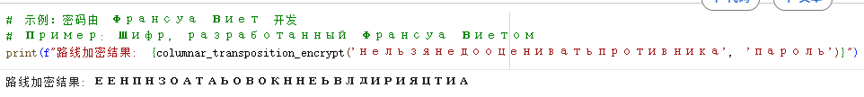
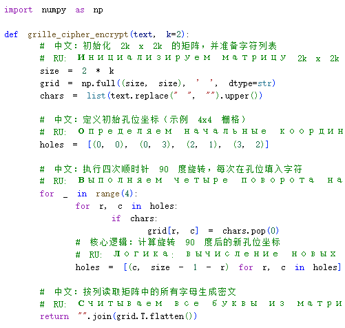
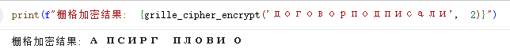
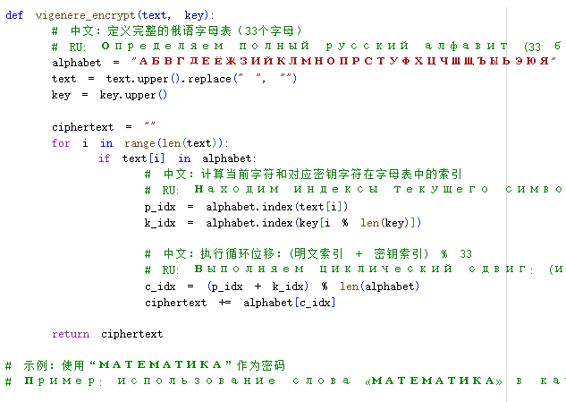

---
## Front matter
title: "Отчёт по лабораторной работе №2"
subtitle: "Математические основы защиты информации и информационной безопасности"
author: "Ли Хан"

## Generic otions
lang: ru-RU
toc-title: "Содержание"

## Bibliography
bibliography: bib/cite.bib
csl: pandoc/csl/gost-r-7-0-5-2008-numeric.csl

## Pdf output format
toc: true
toc-depth: 2
lof: true
lot: true
fontsize: 12pt
linestretch: 1.5
papersize: a4
documentclass: scrreprt
## I18n polyglossia
polyglossia-lang:
  name: russian
  options:
    - spelling=modern
    - babelshorthands=true
polyglossia-otherlangs:
  name: english
## I18n babel
babel-lang: russian
babel-otherlangs: english
## Fonts
mainfont: IBM Plex Serif
romanfont: IBM Plex Serif
sansfont: IBM Plex Sans
monofont: IBM Plex Mono
mathfont: STIX Two Math
mainfontoptions: Ligatures=Common,Ligatures=TeX,Scale=0.94
romanfontoptions: Ligatures=Common,Ligatures=TeX,Scale=0.94
sansfontoptions: Ligatures=Common,Ligatures=TeX,Scale=MatchLowercase,Scale=0.94
monofontoptions: Scale=MatchLowercase,Scale=0.94,FakeStretch=0.9
mathfontoptions:
## Biblatex
biblatex: true
biblio-style: "gost-numeric"
biblatexoptions:
  - parentracker=true
  - backend=biber
  - hyperref=auto
  - language=auto
  - autolang=other*
  - citestyle=gost-numeric
## Pandoc-crossref LaTeX customization
figureTitle: "Рис."
tableTitle: "Таблица"
listingTitle: "Листинг"
lofTitle: "Список иллюстраций"
lotTitle: "Список таблиц"
lolTitle: "Листинги"
## Misc options
indent: true
header-includes:
  - \usepackage{indentfirst}
  - \usepackage{float}
  - \floatplacement{figure}{H}
---

# Цель работы

Изучить основные принципы шифров перестановки, программно реализовать маршрутное шифрование, шифрование с помощью решеток и шифр Виженера, а также понять логический процесс изменения порядка символов или их замены.

# Анализ выполненных упражнений

## Анализ алгоритма маршрутного шифрования

Логика алгоритма: Алгоритм изменяет порядок символов текста с помощью матричной перестановки. Текст записывается по строкам в матрицу, ширина которой зависит от длины ключа, а затем считывается по столбцам в порядке, определяемом алфавитным весом букв ключа.

## шаг

- Определение матрицы: Если текст состоит из 30 символов, а длина ключа — 6, получается матрица $5 \times 6$.

- Запись по строкам: Писываем текст горизонтально, как при обычном письме.

- Сортировка по ключу: Каждой букве ключа (например, «ПАРОЛЬ») присваивается номер согласно её месту в алфавите (А=1, Л=2, О=3...).

- Чтение по столбцам: Считываем буквы не по порядку, а согласно номерам букв ключа. Соседние в тексте буквы оказываются в разных строках, и связь между ними разрывается.

## маршрутного шифрования компилятора

## результат

## Анализ алгоритма шифрования с помощью решеток

Логика алгоритма: Этот метод имитирует вращение физической решетки с прорезями. В матрице $2k \times 2k$ задаются определенные координаты отверстий. После каждого заполнения группы символов координаты поворачиваются на 90 градусов по часовой стрелке до полного заполнения всех четырех направлений.

## шаг

- Конструкция решетки: В квадрате $4 \times 4$ вырезаются 4 отверстия. Они выбираются так, чтобы при повороте карточки на 90, 180 и 270 градусов отверстия никогда не накладывались на уже заполненные клетки.

- В исходном положении через 4 отверстия вписываются первые 4 буквы.

- Решетка поворачивается на 90 градусов, открывая новые пустые клетки, куда вписываются следующие 4 буквы.

- Процесс повторяется, пока все 16 клеток не будут заполнены.

## шифрования с помощью решеток компилятора

## результат

## Анализ шифра Виженера

Логика алгоритма: Это многоалфавитный шифр подстановки. Программа использует зацикленный ключ и выполняет циклический сдвиг для каждого символа по формуле `(индекс текста + индекс ключа) % длина` алфавита.

## шаг

- Улучшение шифра Цезаря: В шифре Цезаря все буквы сдвигаются на $k$ позиций. В шифре Виженера каждая буква сдвигается на разное расстояние, зависящее от буквы ключа.

- Математическая формула:$$C_i = (P_i + K_i) \pmod n$$
  Где $C$ — шифртекст, $P$ — открытый текст, $K$ — позиция буквы ключа в алфавите, $n$ — размер алфавита.

- Логика: Если буква ключа — «B» (2-я в алфавите), то соответствующая буква текста сдвигается на 2 позиции вперед. Поскольку ключ цикличен, переменное смещение делает невозможным простой частотный анализ.

## шифра Виженера компилятора

## результат

# Вывод

В ходе лабораторной работы были успешно реализованы три классические системы шифрования. Эксперимент подтвердил, что шифры перестановки, не меняя содержания символов, эффективно скрывают логику открытого текста через перестановку позиций и циклические сдвиги.

