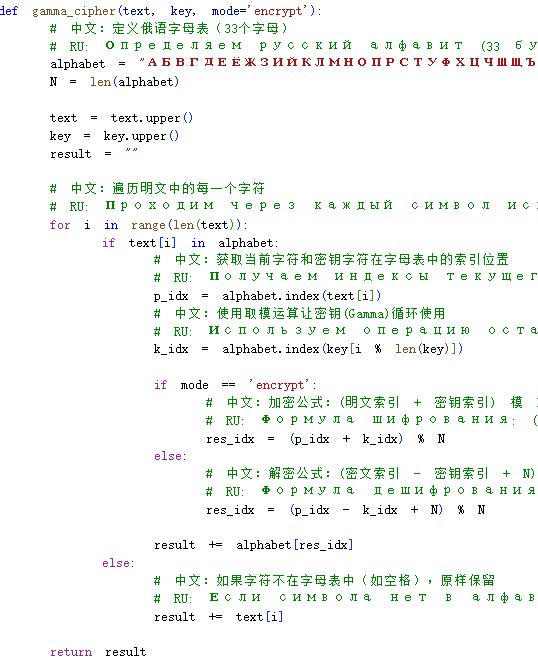
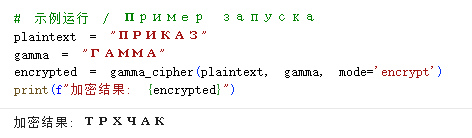

# Цель работы

## Основная цель

я представлю результаты моей третьей лабораторной работы, посвященной шифрованию гаммированием. Если предыдущие шифры перестановки лишь меняли порядок букв, то гаммирование изменяет саму суть каждого символа с помощью «динамического потока ключей».

# Анализ выполненного упражнения

## Анализ основного принципа

При реализации этого алгоритма моё внимание было сосредоточено на арифметике по модулю (Modular Arithmetic).

- Цифровое мышление: Первым делом я перевел русский алфавит в последовательность чисел от 1 до 33. Например, буква «П» соответствует числу 16.

- Логика наложения: Я ввел так называемую «гамму» — ключевой поток. Процесс шифрования — это простое сложение: мы прибавляем число ключа к числу текста. Если сумма превышает 33, операция модуля возвращает нас в начало алфавита.

- Эстетика симметрии: Больше всего в гаммировании меня привлекает симметрия — шифрование выполняется сложением, а дешифрование — вычитанием. Имея ту же гамму, мы можем идеально восстановить информацию.

## Особенности реализации в коде

Прежде всего, обратите внимание на начало кода. Реализованный нами шифр гаммирования основан на арифметике по модулю.
В коде я определил строку alphabet, содержащую 33 буквы русского алфавита.
Согласно заданию, букве «А» присвоен порядковый номер 1 (а не 0, как обычно в программировании).

## Подробные шаги выполнения

- Шаг 1: При вызове функции `gamma_cipher` программа сначала переводит текст и ключ в верхний регистр для обеспечения точности сопоставления.

- Шаг 2: Внутри цикла программа использует alphabet.index(), чтобы найти позицию символа. Чтобы соответствовать номеру 1 из задания, мы добавляем +1 в коде. Например, буква «П» в индексе Python — это 15, после добавления 1 она становится номером 16.

- Шаг 3: Поскольку ключ (например, «ГАММА») обычно короче текста, я использовал прием `i % len(key)`. Это гарантирует, что когда текст дойдет до 6-го символа, ключ автоматически вернется к 1-му символу (букве «Г»), создавая бесконечный поток гаммы.

- Шаг 4: Это самая важная строка кода. Программа выполняет `(p_num + k_num) % 33`.
На примере первой буквы: текст «П» (16) плюс ключ «Г» (4) дает 20. 20 по модулю 33 остается 20.

## принципа реализации алгоритма компилятора

## результат

# Итоги работы

## Вывод

Благодаря этой логике, слово ПРИКАЗ с гаммой ГАММА после шести циклов вычислений превращается в шифртекст `ТРХЧАК`. Это полностью подтверждает теоретический пример из лабораторной работы.
