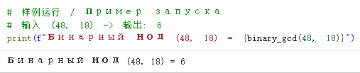
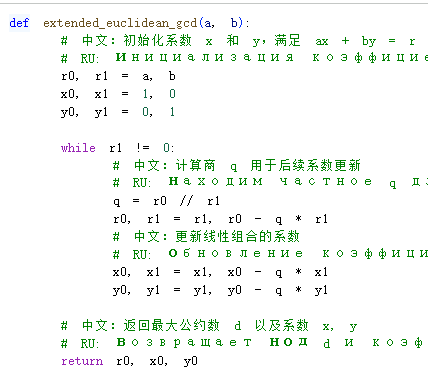
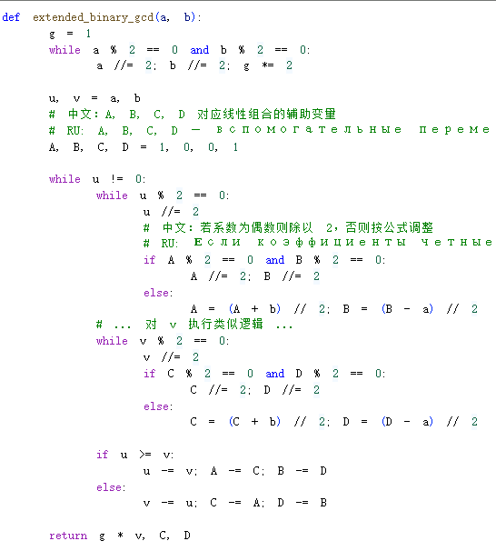
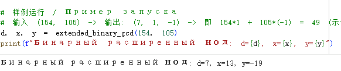

# Цель работы

## Основная цель

я хочу представить результаты моей четвертой лабораторной работы. Моей целью было освоение принципов различных алгоритмов вычисления наибольшего общего делителя. Я стремился не просто получить результат, а через программную практику сравнить логические различия между классическим алгоритмом Евклида и бинарными методами, оптимизированными для компьютера, а также изучить линейное представление НОД через расширенные алгоритмы.

# Детальный разбор четырех алгоритмов

## Алгоритм 1: Алгоритм Евклида

Посмотрите на мою функцию `euclidean_gcd`. Этот алгоритм основан на теореме о делении с остатком

- Функционал кода: Сначала я инициализирую `r0` и `r1`. В цикле while `r1 != 0` программа выполняет основную операцию взятия остатка `r0 % r1`.

- Процесс реализации: На каждой итерации я присваиваю делитель переменной `r0`, а остаток — переменной `r1`.

- Получение результата: Когда остаток r1 становится равным 0, цикл останавливается. В `r0` сохраняется последний ненулевой остаток, который и является $HOH(a, b)$.

## Алгоритм Евклида компилятора

## результат

## Алгоритм 2: Бинарный алгоритм Евклида

Далее идет функция `binary_gcd`. Поскольку компьютеры обрабатывают двоичные сдвиги быстрее деления, этот алгоритм избегает трудоемких операций.

- Функционал кода: Я использую переменную g для извлечения общего множителя 2 из обоих чисел.

- Процесс реализации: В основном цикле я использую логику while u % 2 == 0, чтобы убрать все четные множители из $u$ и $v$. Когда оба числа становятся нечетными, я выполняю вычитание u - v или v - u

- Получение результата: Этот процесс уменьшает масштаб чисел до тех пор, пока $u$ не станет равным 0. В конце я умножаю извлеченный множитель g на v, получая итоговый результат.

## Бинарный алгоритм Евклида компилятора

## результат

## Алгоритм 3: Расширенный алгоритм Евклида

Теперь обратите внимание на функцию `extended_euclidean_gcd`. Она находит не только НОД, но и коэффициенты `x` и `y` для уравнения $ax + by = d$.

- Функционал кода: В коде я дополнительно содержу последовательности коэффициентов `x` и `y`

- Процесс реализации: На каждом шаге деления с остатком я получаю частное `q` и обновляю не только остаток, но и коэффициенты по формуле $x_{i-1} - q \cdot x_i$.

- Получение результата: Когда остаток $r_{i+1}$ равен 0, функция возвращает НОД $d$ вместе с коэффициентами `x` и `y`.

## Расширенный алгоритм Евклида компилятора

## результат

## Алгоритм 4: Расширенный бинарный алгоритм Евклида

Это самая сложная функция `extended_binary_gcd`. Она находит `d, x, y` вообще без использования операции деления.

- Функционал кода: При обработке четного `u` я не просто делю его на 2 , но и одновременно корректирую коэффициенты `A` и `B`, проверяя их четность

- Процесс реализации: Если коэффициенты нечетные, код выполняет операцию типа $(A + b) // 2$, чтобы вычисления оставались в рамках целых чисел.

- Получение результата: Этот метод сочетает эффективность бинарного алгоритма и функциональность расширенного, выдавая на выходе `d, x, y`.

## Расширенный бинарный алгоритм Евклида компилятора

## результат

# Итоги работы

## Вывод

В ходе этой работы я успешно реализовал все изученные алгоритмы поиска НОД. Я обнаружил, что хотя классический алгоритм Евклида наиболее прост логически, бинарный алгоритм демонстрирует более высокую эффективность на низком уровне за счет сдвигов и вычитания. Линейное представление, полученное с помощью расширенных алгоритмов, заложило математическую основу для моего дальнейшего изучения модульной инверсии и сравнений. Спасибо за внимание!
