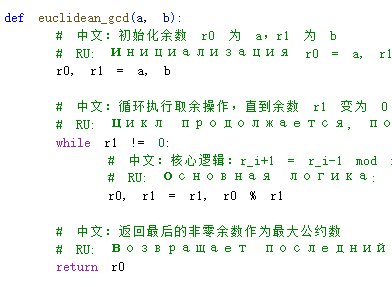
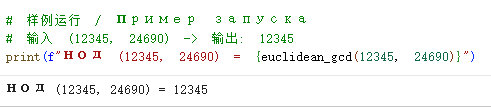
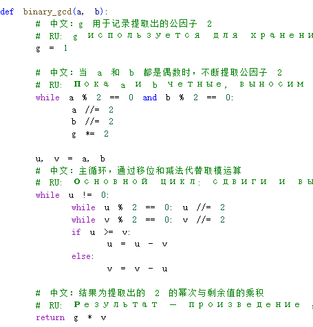
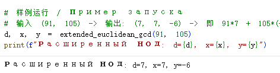

---
## Front matter
title: "Отчёт по лабораторной работе №4"
subtitle: "Математические основы защиты информации и информационной безопасности"
author: "Ли Хан"

## Generic otions
lang: ru-RU
toc-title: "Содержание"

## Bibliography
bibliography: bib/cite.bib
csl: pandoc/csl/gost-r-7-0-5-2008-numeric.csl

## Pdf output format
toc: true
toc-depth: 2
lof: true
lot: true
fontsize: 12pt
linestretch: 1.5
papersize: a4
documentclass: scrreprt
## I18n polyglossia
polyglossia-lang:
  name: russian
  options:
    - spelling=modern
    - babelshorthands=true
polyglossia-otherlangs:
  name: english
## I18n babel
babel-lang: russian
babel-otherlangs: english
## Fonts
mainfont: IBM Plex Serif
romanfont: IBM Plex Serif
sansfont: IBM Plex Sans
monofont: IBM Plex Mono
mathfont: STIX Two Math
mainfontoptions: Ligatures=Common,Ligatures=TeX,Scale=0.94
romanfontoptions: Ligatures=Common,Ligatures=TeX,Scale=0.94
sansfontoptions: Ligatures=Common,Ligatures=TeX,Scale=MatchLowercase,Scale=0.94
monofontoptions: Scale=MatchLowercase,Scale=0.94,FakeStretch=0.9
mathfontoptions:
## Biblatex
biblatex: true
biblio-style: "gost-numeric"
biblatexoptions:
  - parentracker=true
  - backend=biber
  - hyperref=auto
  - language=auto
  - autolang=other*
  - citestyle=gost-numeric
## Pandoc-crossref LaTeX customization
figureTitle: "Рис."
tableTitle: "Таблица"
listingTitle: "Листинг"
lofTitle: "Список иллюстраций"
lotTitle: "Список таблиц"
lolTitle: "Листинги"
## Misc options
indent: true
header-includes:
  - \usepackage{indentfirst}
  - \usepackage{float}
  - \floatplacement{figure}{H}
---

# Цель работы

Изучить принципы различных алгоритмов поиска наибольшего общего делителя (НОД), включая алгоритм Евклида и его модификации. На практике реализовать и сравнить логику алгоритмов при работе с целыми числами, а также освоить нахождение линейной комбинации (соотношение Безу) с помощью расширенных алгоритмов.

# Анализ логики алгоритмов

## Алгоритм Евклида

Классический метод нахождения НОД. Основан на последовательном делении с остатком до тех пор, пока остаток не станет равен нулю.

Шаги реализации:

- Инициализация: Присвоить $r_0 = a$, $r_1 = b$.

- Деление: Найти остаток $r_{i+1}$ от деления $r_{i-1}$ на $r_i$.

- Проверка: Если $r_{i+1} = 0$, алгоритм завершается

- Результат: НОД равен $r_i$. В противном случае повторить шаг 2.

### Алгоритм Евклида компилятора

### результат

## Бинарный алгоритм Евклида

Более быстрый алгоритм для компьютерной реализации. Использует свойства четности чисел и заменяет деление на сдвиги и вычитание.

Шаги реализации:

- Общий множитель: Вынести общую степень двойки в переменную $g$.

- Устранение четности: Делить $u$ и $v$ на 2, пока они не станут нечетными

- Итерация: Если $u \ge v$, положить $u = u - v$, иначе $v = v - u$.

- Финал: Когда $u = 0$, итоговый $НОД = g \cdot v$.

### Бинарный алгоритм Евклида компилятора

### результат

## Расширенный алгоритм Евклида

Позволяет найти не только НОД $d$, но и целые числа $x, y$, такие что $ax + by = d$.

Шаги реализации:

- Инициализация: Задать начальные значения остатков $r$ и коэффициентов $x, y$.

- Деление с остатком: Найти частное $q_i$ и остаток $r_{i+1}$.

- Пересчет: Обновить коэффициенты $x_{i+1}$ и $y_{i+1}$ через полученное частное $q_i$.

- Завершение: При $r_{i+1}=0$ выдать результат $d, x, y$.

### Расширенный алгоритм Евклида компилятора

### результат

## Расширенный бинарный алгоритм Евклида

Модификация бинарного алгоритма для поиска коэффициентов $x, y$ без использования операции деления.

Шаги реализации:

- Подготовка: Извлечь общую степень двойки $g$.

- Сдвиги: Пока $u$ или $v$ четные, выполнять деление на 2.

- Корректировка: Если коэффициенты нечетные, прибавить к ним исходные числа $a$ или $b$ перед делением на 2.

- Вычитание: Обновлять значения $u, v$ и коэффициенты до обнуления $u$.

### Расширенный бинарный алгоритм Евклида компилятора

### результат

# Вывод

Экспериментально подтверждено, что классический алгоритм Евклида является наиболее простым в реализации, в то время как бинарный алгоритм эффективнее на низком уровне за счет исключения деления. Расширенные алгоритмы позволяют не только найти НОД, но и представить его в виде линейной комбинации исходных чисел, что критически важно для решения диофантовых уравнений.
