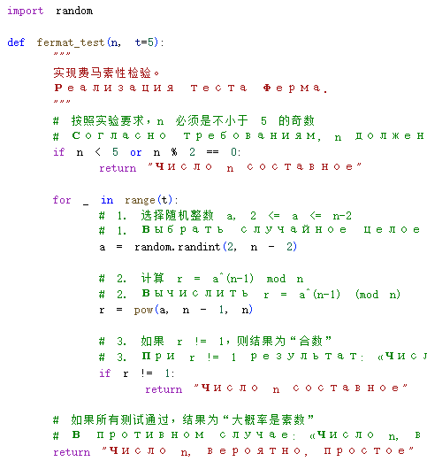
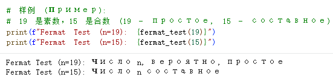
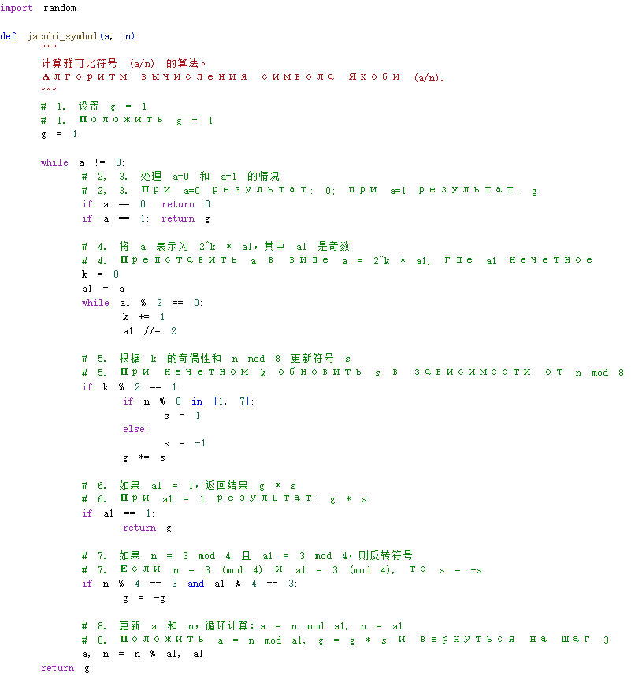
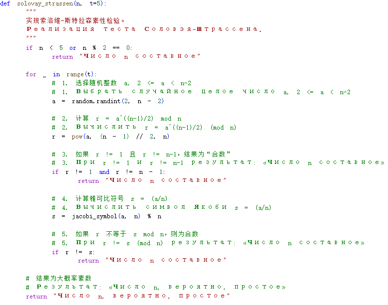
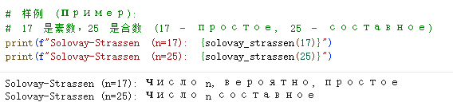
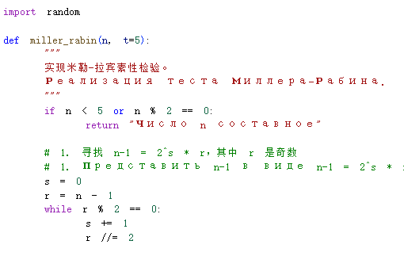
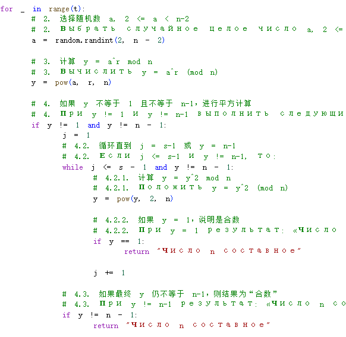
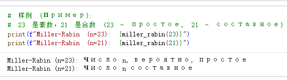

---
## Front matter
title: "Отчёт по лабораторной работе №5"
subtitle: "Математические основы защиты информации и информационной безопасности"
author: "Ли Хан"

## Generic otions
lang: ru-RU
toc-title: "Содержание"

## Bibliography
bibliography: bib/cite.bib
csl: pandoc/csl/gost-r-7-0-5-2008-numeric.csl

## Pdf output format
toc: true
toc-depth: 2
lof: true
lot: true
fontsize: 12pt
linestretch: 1.5
papersize: a4
documentclass: scrreprt
## I18n polyglossia
polyglossia-lang:
  name: russian
  options:
    - spelling=modern
    - babelshorthands=true
polyglossia-otherlangs:
  name: english
## I18n babel
babel-lang: russian
babel-otherlangs: english
## Fonts
mainfont: IBM Plex Serif
romanfont: IBM Plex Serif
sansfont: IBM Plex Sans
monofont: IBM Plex Mono
mathfont: STIX Two Math
mainfontoptions: Ligatures=Common,Ligatures=TeX,Scale=0.94
romanfontoptions: Ligatures=Common,Ligatures=TeX,Scale=0.94
sansfontoptions: Ligatures=Common,Ligatures=TeX,Scale=MatchLowercase,Scale=0.94
monofontoptions: Scale=MatchLowercase,Scale=0.94,FakeStretch=0.9
mathfontoptions:
## Biblatex
biblatex: true
biblio-style: "gost-numeric"
biblatexoptions:
  - parentracker=true
  - backend=biber
  - hyperref=auto
  - language=auto
  - autolang=other*
  - citestyle=gost-numeric
## Pandoc-crossref LaTeX customization
figureTitle: "Рис."
tableTitle: "Таблица"
listingTitle: "Листинг"
lofTitle: "Список иллюстраций"
lotTitle: "Список таблиц"
lolTitle: "Листинги"
## Misc options
indent: true
header-includes:
  - \usepackage{indentfirst}
  - \usepackage{float}
  - \floatplacement{figure}{H}
---

# Цель работы

Изучить и освоить вероятностные алгоритмы проверки чисел на простоту, широко используемые в криптографии. Реализовать программно тесты Ферма, Соловэя-Штрассена и Миллера-Рабина, а также понять их основные принципы и вероятность ошибки.

# Подробное описание реализации алгоритмов

## Тест Ферма

Основан на малой теореме Ферма: для простого $p$ выполняется $a^{p-1} \equiv 1 \pmod p$.

Шаги реализации:

- Вход: Нечетное целое число $n \ge 5$.

- Выбор основания: Выбрать случайное целое число $a$ в диапазоне $2 \le a \le n-2$.

- Вычисление: Вычислить $r = a^{n-1} \pmod{n}$.

- Проверка результата:

  - Если $r = 1$, результат: «Число $n$, вероятно, простое».

  - В противном случае результат: «Число $n$ составное».

### Тест Ферма компилятора

### результат

## Алгоритм вычисления символа Якоби

Инструмент для определения квадратичных вычетов, вычисляемый через рекурсивное применение закона взаимности.

Шаги реализации:

- Инициализация: Положить $g = 1$.

- Обработка значений: При $a = 0$ результат 0; при $a = 1$ результат $g$.

- Выделение множителя 2: Представить $a$ в виде $a = 2^k \cdot a_1$, где число $a_1$ нечетное.

- Обработка множителей: При нечетном $k$: $s = 1$, если $n \equiv \pm 1 \pmod{8}$; $s = -1$, если $n \equiv \pm 3 \pmod{8}$. При четном $k$ положить $s = 1$.

- Закон взаимности: Если $n \equiv 3 \pmod{4}$ и $a_1 \equiv 3 \pmod{4}$, то $s = -s$.

- Итерация: Положить $a = n \pmod{a_1}$, $g = g \cdot s$ и вернуться к шагу 2.

### Алгоритм вычисления символа Якоби компилятора

## Тест Соловэя-Штрассена

Использует критерий Эйлера, сравнивая результат возведения в степень с символом Якоби.

Шаги реализации:

- Вход: нечетное $n \ge 5$.

- Выбрать случайное $a \in [2, n-2]$.

- Вычислить $r = a^{(n-1)/2} \pmod n$.

- Если $r \ne 1$ и $r \ne n-1$, число составное.

- Вычислить символ Якоби $s = (\frac{a}{n})$. 

- Если $r \equiv s \pmod n$, число вероятно простое; иначе — составное.

### Тест Соловэя-Штрассена компилятора

### результат

## Тест Миллера-Рабина

Самый эффективный современный тест, основанный на поиске нетривиальных корней из единицы.

Шаги реализации:

- Разложить $n-1 = 2^s \cdot r$, где $r$ нечетное.

- Выбрать случайное $a \in [2, n-2]$.

- Вычислить $y = a^r \pmod n$.

- Если $y \ne 1$ и $y \ne n-1$: возводить $y$ в квадрат до $s-1$ раз.

- Если $y$ становится 1 в процессе — составное; если в конце $y \ne n-1$ — составное.

- Иначе — число вероятно простое.

### Тест Миллера-Рабинаа компилятора

### Тест Миллера-Рабинаа компилятора

### результат

# Вывод

Реализованы три алгоритма. Установлено, что точность повышается с количеством тестов $t$, а вероятность ошибки не превышает $1/2^t$. Тест Миллера-Рабина является наиболее надежным.
