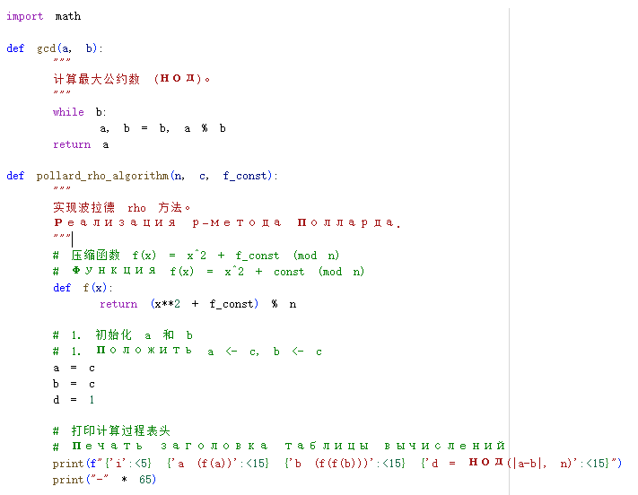
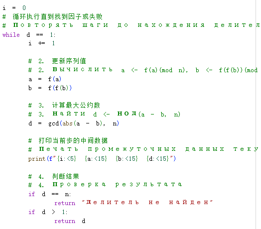
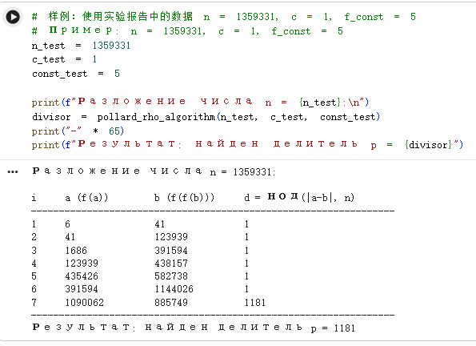

---
## Front matter
title: "Отчёт по лабораторной работе №6"
subtitle: "Математические основы защиты информации и информационной безопасности"
author: "Ли Хан"

## Generic otions
lang: ru-RU
toc-title: "Содержание"

## Bibliography
bibliography: bib/cite.bib
csl: pandoc/csl/gost-r-7-0-5-2008-numeric.csl

## Pdf output format
toc: true
toc-depth: 2
lof: true
lot: true
fontsize: 12pt
linestretch: 1.5
papersize: a4
documentclass: scrreprt
## I18n polyglossia
polyglossia-lang:
  name: russian
  options:
    - spelling=modern
    - babelshorthands=true
polyglossia-otherlangs:
  name: english
## I18n babel
babel-lang: russian
babel-otherlangs: english
## Fonts
mainfont: IBM Plex Serif
romanfont: IBM Plex Serif
sansfont: IBM Plex Sans
monofont: IBM Plex Mono
mathfont: STIX Two Math
mainfontoptions: Ligatures=Common,Ligatures=TeX,Scale=0.94
romanfontoptions: Ligatures=Common,Ligatures=TeX,Scale=0.94
sansfontoptions: Ligatures=Common,Ligatures=TeX,Scale=MatchLowercase,Scale=0.94
monofontoptions: Scale=MatchLowercase,Scale=0.94,FakeStretch=0.9
mathfontoptions:
## Biblatex
biblatex: true
biblio-style: "gost-numeric"
biblatexoptions:
  - parentracker=true
  - backend=biber
  - hyperref=auto
  - language=auto
  - autolang=other*
  - citestyle=gost-numeric
## Pandoc-crossref LaTeX customization
figureTitle: "Рис."
tableTitle: "Таблица"
listingTitle: "Листинг"
lofTitle: "Список иллюстраций"
lotTitle: "Список таблиц"
lolTitle: "Листинги"
## Misc options
indent: true
header-includes:
  - \usepackage{indentfirst}
  - \usepackage{float}
  - \floatplacement{figure}{H}
---

# Цель работы

Изучить основные задачи и алгоритмы разложения чисел на множители. Реализовать программно $\rho$-метод Полларда, понять принципы поиска нетривиальных делителей составных чисел в криптоанализе и выполнить численные расчеты на основе заданных начальных параметров.

# Модуль реализации алгоритма

## Описание $\rho$-метода Полларда

$\rho$-метод Полларда — это рандомизированный алгоритм факторизации целых чисел. Он основан на математическом принципе «парадокса дней рождения» и использует сжимающие свойства случайных отображений для поиска циклов в последовательностях. Этот алгоритм крайне эффективен для разложения чисел, имеющих небольшие простые делители, и имеет временную сложность около $O(n^{1/4})$.

## Шаги реализации:

- Инициализация: Установить переменные $a$ и $b$, присвоив им начальное значение $c$.

- Итерация: Обновлять последовательность с помощью функции $f(x) = x^2 + \text{const} \pmod n$. При этом $a$ обновляется один раз за шаг ($a \leftarrow f(a)$), а $b$ — дважды ($b \leftarrow f(f(b))$).

- Вычисление НОД: На каждом шаге вычислять $d = \text{НОД}(|a - b|, n)$.

- Проверка результата:

  - Если $1 < d < n$, то $d$ является нетривиальным делителем числа $n$, алгоритм завершен успешно.

  - Если $d = n$, результат: «Делитель не найден», алгоритм завершен неудачей.

  - Если $d = 1$, вернуться к шагу 2 для продолжения итерации.

### $\rho$-метода Полларда компилятора

### $\rho$-метода Полларда компилятора

### результат

# Вывод

В ходе выполнения данной работы был успешно реализован и протестирован $\rho$-метод Полларда. При заданных параметрах $c=1$ и константе $5$ было произведено разложение числа $1359331$. На 7-й итерации был найден делитель $1181$. Это подтверждает эффективность и быструю сходимость данного алгоритма при поиске делителей больших составных чисел.
