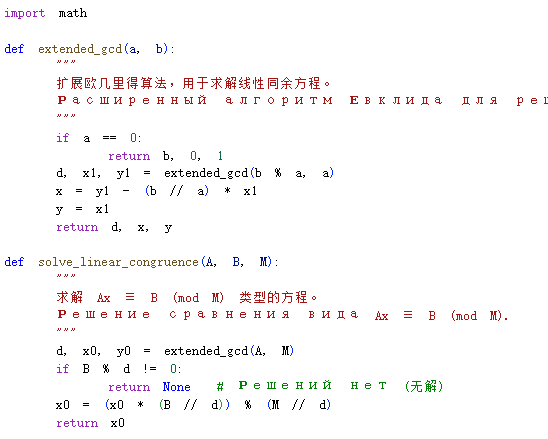
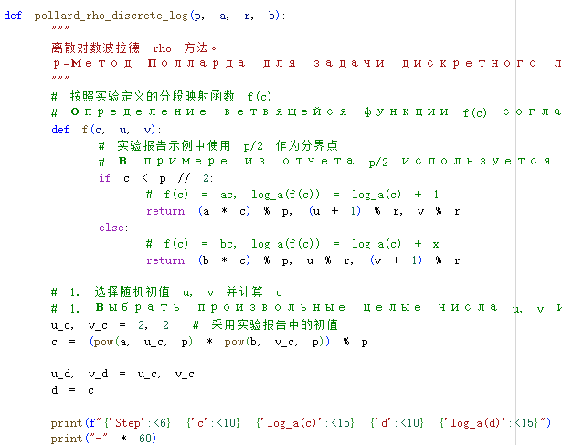
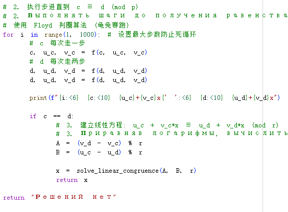
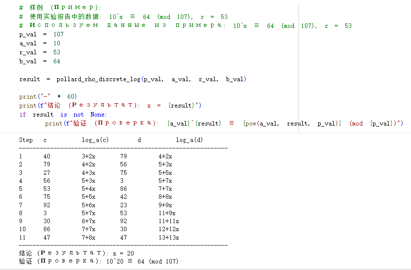

---
## Front matter
title: "Отчёт по лабораторной работе №7"
subtitle: "Математические основы защиты информации и информационной безопасности"
author: "Ли Хан"

## Generic otions
lang: ru-RU
toc-title: "Содержание"

## Bibliography
bibliography: bib/cite.bib
csl: pandoc/csl/gost-r-7-0-5-2008-numeric.csl

## Pdf output format
toc: true
toc-depth: 2
lof: true
lot: true
fontsize: 12pt
linestretch: 1.5
papersize: a4
documentclass: scrreprt
## I18n polyglossia
polyglossia-lang:
  name: russian
  options:
    - spelling=modern
    - babelshorthands=true
polyglossia-otherlangs:
  name: english
## I18n babel
babel-lang: russian
babel-otherlangs: english
## Fonts
mainfont: IBM Plex Serif
romanfont: IBM Plex Serif
sansfont: IBM Plex Sans
monofont: IBM Plex Mono
mathfont: STIX Two Math
mainfontoptions: Ligatures=Common,Ligatures=TeX,Scale=0.94
romanfontoptions: Ligatures=Common,Ligatures=TeX,Scale=0.94
sansfontoptions: Ligatures=Common,Ligatures=TeX,Scale=MatchLowercase,Scale=0.94
monofontoptions: Scale=MatchLowercase,Scale=0.94,FakeStretch=0.9
mathfontoptions:
## Biblatex
biblatex: true
biblio-style: "gost-numeric"
biblatexoptions:
  - parentracker=true
  - backend=biber
  - hyperref=auto
  - language=auto
  - autolang=other*
  - citestyle=gost-numeric
## Pandoc-crossref LaTeX customization
figureTitle: "Рис."
tableTitle: "Таблица"
listingTitle: "Листинг"
lofTitle: "Список иллюстраций"
lotTitle: "Список таблиц"
lolTitle: "Листинги"
## Misc options
indent: true
header-includes:
  - \usepackage{indentfirst}
  - \usepackage{float}
  - \floatplacement{figure}{H}
---

# Цель работы

Изучить задачу дискретного логарифмирования в конечных полях и её применение в криптографии с открытым ключом. Реализовать программно $\rho$-метод Полларда для нахождения показателя $x$ в сравнении $a^x \equiv b \pmod{p}$, понять принципы поиска коллизий и решения линейных сравнений в циклических группах.

# Модуль реализации алгоритма

## Модуль реализации алгоритма

$\rho$-метод Полларда для дискретного логарифмирования основан на поиске совпадений (коллизий) в последовательности элементов группы. Для этого используется специальное случайное отображение $f$, которое должно обладать свойством «вычислимости логарифма». Это означает, что если текущий элемент последовательности имеет вид $c = a^u b^v \pmod{p}$, то для следующего элемента $f(c)$ также должны быть известны коэффициенты в его представлении через $a$ и $b$. При обнаружении коллизии $c_i = c_j$ задача сводится к решению линейного сравнения относительно неизвестного $x$.

## Шаги реализации:

- Инициализация: 

  - Выбрать произвольные целые числа $u$ и $v$.

  - Вычислить начальное значение $c = a^u b^v \pmod{p}$.

  - Установить два указателя: медленный ($c$) и быстрый ($d$), где изначально $d = c$.

- Итерационный цикл:

  - Обновлять значения с помощью ветвящегося отображения $f(c)$.

  - На каждом шаге медленный указатель делает один шаг ($c = f(c)$), а быстрый — два ($d = f(f(d))$).

  - Одновременно вычислять логарифмы для $c$ и $d$ как линейные функции от $x$: $u + v \cdot x \pmod{r}$, где $r$ — порядок числа $a$

  - Продолжать до тех пор, пока не будет получено равенство $c \equiv d \pmod{p}$.

- Решение сравнения:

  - Приравнять логарифмы, полученные при коллизии: $u_c + v_c \cdot x \equiv u_d + v_d \cdot x \pmod{r}$.

  - Решить полученное линейное сравнение первой степени относительно $x$.

  - Результат: найденное значение $x$ или сообщение «Решений нет».

### Модуль реализации алгоритма компилятора

### Модуль реализации алгоритма компилятора

### Модуль реализации алгоритма компилятора

### результат

# Вывод

В ходе выполнения работы был успешно реализован $\rho$-метод Полларда для задачи дискретного логарифмирования. На примере сравнения $10^x \equiv 64 \pmod{107}$ было продемонстрировано нахождение коллизии на 11-м шаге вычислений. Путем решения линейного сравнения $7 + 8x \equiv 13 + 13x \pmod{53}$ было получено значение $x = 20 \pmod{53}$. Проверка подтвердила правильность результата: $10^{20} \equiv 64 \pmod{107}$. Алгоритм показал свою эффективность, сводя сложную задачу логарифмирования к поиску совпадений в последовательности и решению простых сравнений.
