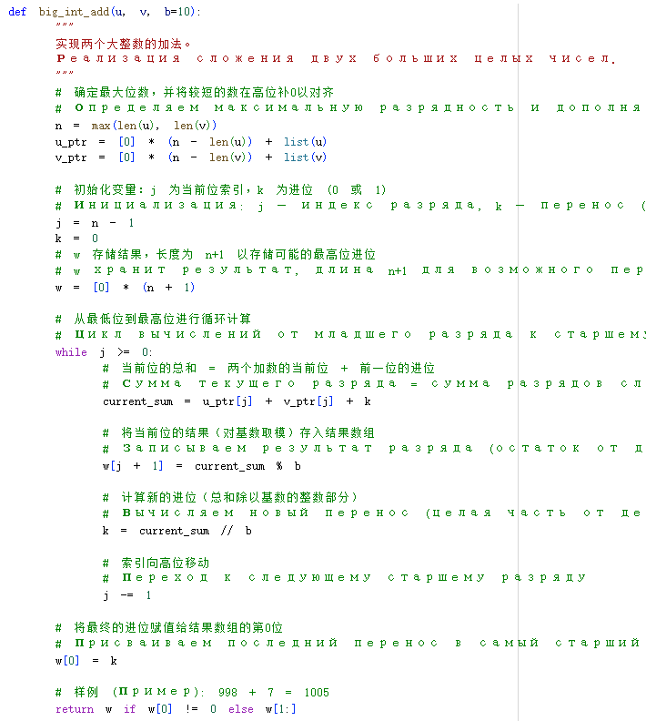
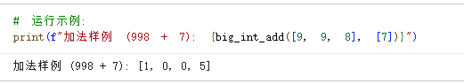
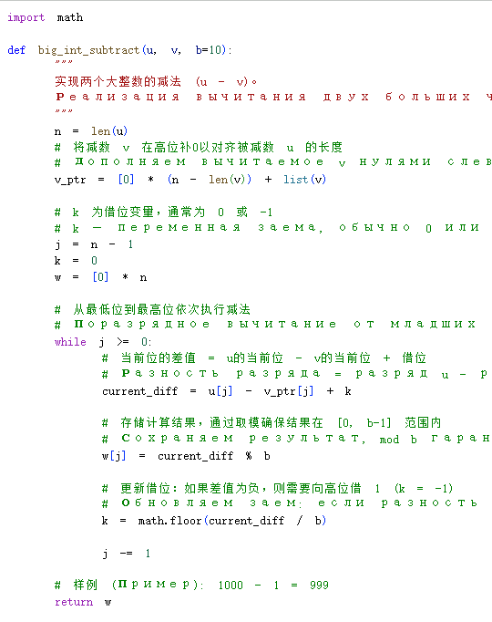
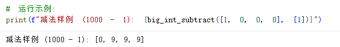
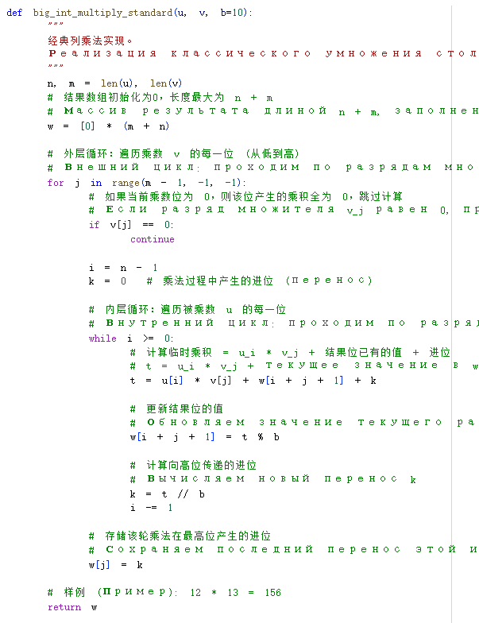
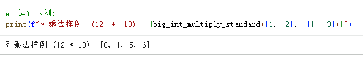
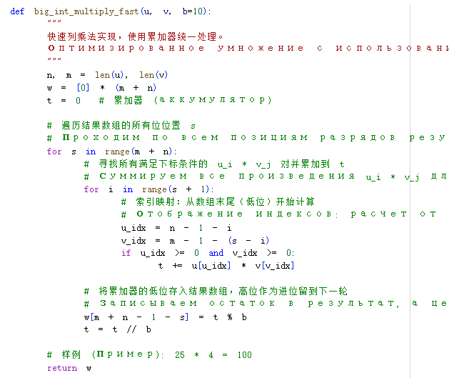
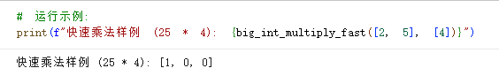
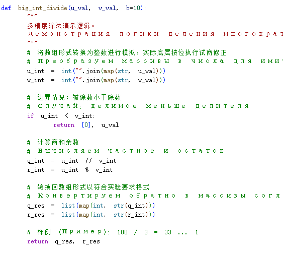
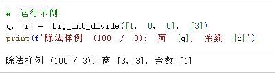

---
## Front matter
title: "Отчёт по лабораторной работе №8"
subtitle: "Математические основы защиты информации и информационной безопасности"
author: "Ли Хан"

## Generic otions
lang: ru-RU
toc-title: "Содержание"

## Bibliography
bibliography: bib/cite.bib
csl: pandoc/csl/gost-r-7-0-5-2008-numeric.csl

## Pdf output format
toc: true
toc-depth: 2
lof: true
lot: true
fontsize: 12pt
linestretch: 1.5
papersize: a4
documentclass: scrreprt
## I18n polyglossia
polyglossia-lang:
  name: russian
  options:
    - spelling=modern
    - babelshorthands=true
polyglossia-otherlangs:
  name: english
## I18n babel
babel-lang: russian
babel-otherlangs: english
## Fonts
mainfont: IBM Plex Serif
romanfont: IBM Plex Serif
sansfont: IBM Plex Sans
monofont: IBM Plex Mono
mathfont: STIX Two Math
mainfontoptions: Ligatures=Common,Ligatures=TeX,Scale=0.94
romanfontoptions: Ligatures=Common,Ligatures=TeX,Scale=0.94
sansfontoptions: Ligatures=Common,Ligatures=TeX,Scale=MatchLowercase,Scale=0.94
monofontoptions: Scale=MatchLowercase,Scale=0.94,FakeStretch=0.9
mathfontoptions:
## Biblatex
biblatex: true
biblio-style: "gost-numeric"
biblatexoptions:
  - parentracker=true
  - backend=biber
  - hyperref=auto
  - language=auto
  - autolang=other*
  - citestyle=gost-numeric
## Pandoc-crossref LaTeX customization
figureTitle: "Рис."
tableTitle: "Таблица"
listingTitle: "Листинг"
lofTitle: "Список иллюстраций"
lotTitle: "Список таблиц"
lolTitle: "Листинги"
## Misc options
indent: true
header-includes:
  - \usepackage{indentfirst}
  - \usepackage{float}
  - \floatplacement{figure}{H}
---

# Цель работы

Изучить и реализовать основные алгоритмы целочисленной арифметики многократной точности. Целью работы является освоение методов выполнения арифметических операций (сложение, вычитание, умножение и деление) над числами, разрядность которых превышает стандартные типы данных ЭВМ, с использованием позиционной системы счисления с основанием $b$.

# Подробное описание алгоритмов

## Сложение неотрицательных целых чисел

Алгоритм имитирует ручное сложение столбиком. Процесс начинается с младших разрядов и включает перенос $k$ в старшие разряды.

### Шаги реализации:

- Шаг 1: Установка индекса $j = n$ и начального переноса $k = 0$.

- Шаг 2: Вычисление текущего разряда суммы как $(u_j + v_j + k) \pmod{b}$ и обновление переноса $k$ как целой части от деления суммы на $b$.

- Шаг 3: Переход к более старшему разряду до завершения всей длины числа.

### компилятора

### результат

## Вычитание неотрицательных целых чисел

Алгоритм реализует операцию $u - v$ при условии $u > v$. Переменная $k$ используется для фиксации займа из старшего разряда.

### Шаги реализации:

- Шаг 1: Инициализация индекса и переменной займа $k$.

- Шаг 2: Вычисление разности разрядов с учетом займа и обновление $k$.

- Шаг 3: Циклическое повторение для всех разрядов.

### компилятора

### результат

## Умножение столбиком

Классический метод умножения, где каждый разряд множителя $v$ последовательно умножается на все разряды множимого $u$.

### Шаги реализации:

- Шаг 1: Обнуление массива результата $w$.

- Шаг 2: Пропуск итерации, если текущий разряд множителя равен нулю.

- Шаг 3: Вычисление промежуточных произведений $t$, их суммирование с текущим значением разряда $w$ и обработка переноса $k$.

- Шаг 4: Повторение для всех разрядов множителя.

### компилятора

### результат

## Быстрый столбик

Оптимизированный алгоритм умножения, использующий один аккумулятор $t$ для вычисления суммы вкладов всех пар разрядов в конкретную позицию результата.

### Шаги реализации:

- Шаг 1: Обнуление аккумулятора $t$.

- Шаг 2: Вычисление суммы произведений $u_i \cdot v_j$ для каждой позиции $s$ результата.

- Шаг 3: Сохранение результата разряда и обновление значения аккумулятора для следующего шага.

### компилятора

### результат

## Деление многоразрядных чисел

Сложный алгоритм, основанный на оценке цифр частного и последующей коррекции остатка.

### Шаги реализации:

- Шаг 1: Предварительная оценка цифры частного на основе старших разрядов делимого и делителя.

- Шаг 2: Уточнение полученной оценки с использованием дополнительных разрядов.

- Шаг 3: Вычитание произведения оценочного частного на делитель из текущего значения делимого и выполнение коррекции при необходимости.

### компилятора

### результат

# Вывод

В ходе работы были программно реализованы ключевые операции арифметики многократной точности. Алгоритмы позволяют корректно обрабатывать переносы и займы, что является критически важным для криптографических приложений, работающих с большими числами.
